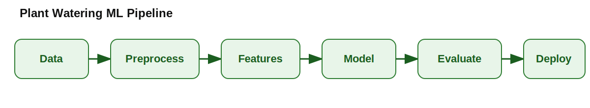
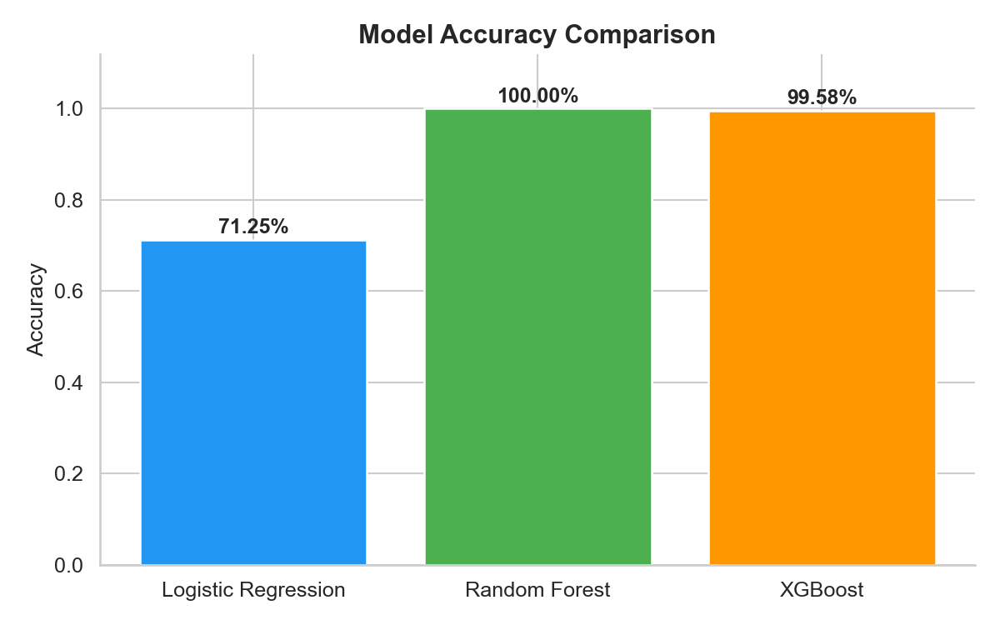
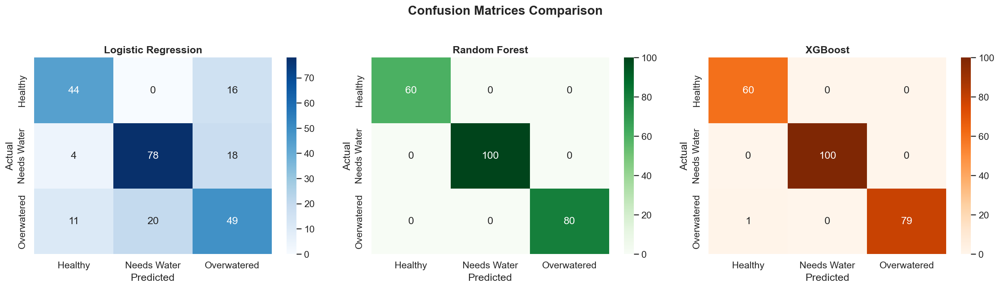

# Plant Watering System

AI-powered plant health monitoring and watering decision support built during an AI/ML fellowship.

## 1) Overview

The project predicts plant health from sensor and engineered features, then combines ML predictions with a rule-based engine to recommend watering actions.

**Classes used by the app UI:**
- Healthy
- Needs Water
- Overwatered

## 2) Project Structure

```text
Plant-Watering-System/
├── app/                       # Streamlit app
├── src/                       # Data, modeling, inference, backend modules
├── data/
│   ├── raw/                   # Original dataset
│   ├── processed/             # Train/test splits and cleaned files
│   └── README.md              # Data dictionary + file naming guide
├── reports/                   # Model metrics and figures
├── demo/
│   └── screenshots/           # Demo screenshots used in README
├── docs/
│   └── pipeline_diagram.svg   # Pipeline diagram (Data → Deploy)
├── assets/                    # Placeholder for user-added media
├── requirements.txt
├── CONTRIBUTING.md
├── LICENSE
└── README.md
```

## 3) Installation

```bash
git clone <repository-url>
cd Plant-Watering-System
python -m venv .venv
source .venv/bin/activate  # Windows: .venv\Scripts\activate
pip install -r requirements.txt
```

## 4) Run the App

```bash
streamlit run app/app.py
```

Open: `http://localhost:8501`

## 5) Model Training Workflow

```bash
python src/data/preprocess.py
python src/models/train_logistic.py
python src/models/train_rf.py
python src/models/train_xgb.py
python src/models/compare_models.py
```

## 6) Model Validation (Leakage Check + Evaluation)

### Train/Test split method
- `train_test_split(..., test_size=0.2, random_state=42, stratify=y)` is used in preprocessing.
- This keeps class balance in train and test sets.

### Cross-validation
- Additional validation done with **Stratified 5-Fold CV** for Random Forest.
- Observed scores from local check:
  - Fold accuracies: `[1.0000, 0.9958, 1.0000, 1.0000, 0.9917]`
  - Mean CV accuracy: **0.9975**

### Confusion matrices
- Combined confusion matrix figure:
  - `reports/figures/model_comparison/confusion_matrices.png`

### Why near-perfect RF performance is suspicious (and what we found)
- Initial 100% RF holdout score is unusually high for real-world sensor data.
- We tested group-aware splitting by `Plant_ID` to reduce identity leakage risk; accuracy remained ~99.58%.
- Conclusion: the data appears highly separable and likely **synthetic or simulation-like** (not noisy real field data), which can legitimately produce near-perfect metrics.

## 7) Metrics Snapshot

| Model | Accuracy | Precision | Recall | F1-Score |
|---|---:|---:|---:|---:|
| Logistic Regression | 71.25% | 71.49% | 71.25% | 71.36% |
| Random Forest | 100.00% | 100.00% | 100.00% | 100.00% |
| XGBoost | 99.58% | 99.59% | 99.58% | 99.58% |

> Recommended deployment model: **XGBoost** (strong performance with better practical robustness tradeoff than a perfect-score RF on synthetic-like data).

## 8) Demo Visuals

### Pipeline Diagram


### Screenshots



### Short Demo Video


## 9) Rule Engine Threshold Configuration

Thresholds are parameterized in `src/utils/config.py` and can now be tuned in **Settings** page sliders.

Default keys:
- `soil_moisture_low`
- `soil_moisture_high`
- `temperature_high`
- `humidity_low`
- `days_since_water`

## 10. Team Contributions

| Member | Contribution |
|--------|-------------|
| [Meher Ali](https://github.com/magic-meer) | Model benchmarking, system integration |
| [Maryam Fatima](https://github.com/maryam-ca) | Frontend development, visualizations |
| [Rameesha](https://github.com/Rameesha8) | XGBoost modeling, backend support |
| [Ayesha](https://github.com/Ayesha0000000) | Data preprocessing, feature engineering |
| [Hammad Ali](https://github.com/hammadali155) | Baseline models, preprocessing support |

## 11) Data Source Credits
- Dataset title: **Plant Watering Sensor Dataset (Project Internal Build)**
- Author/owner: **Plant Watering System Fellowship Team**
- URL (repo file): <./data/raw/original_dataset.csv>
- Data processing notes: <./data/README.md>

## 12) Acknowledgement

This project was developed as part of an **AI/ML Fellowship Program**, with collaborative support from mentors, peers, and the open-source ML community.

## 13) Contact

For issues, suggestions, and collaboration:
- Open a GitHub issue in this repository.

## 14) License

Licensed under Apache-2.0. See [LICENSE](LICENSE).
